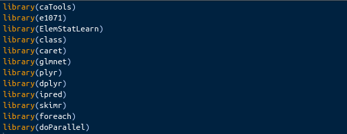
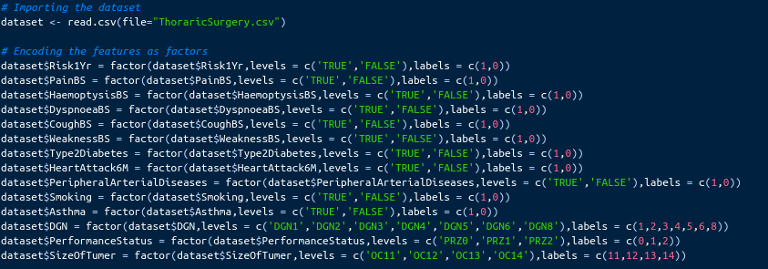
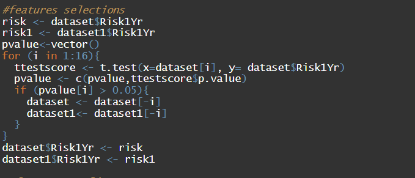
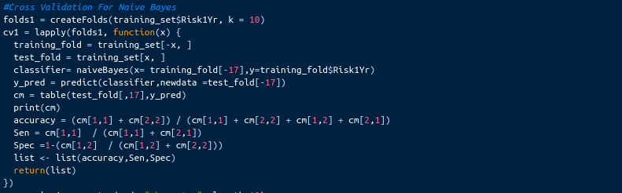
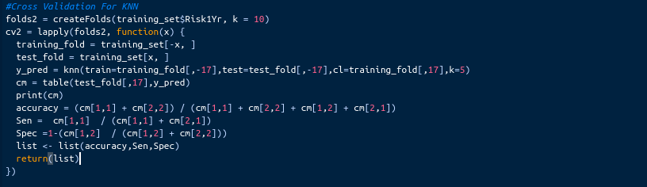
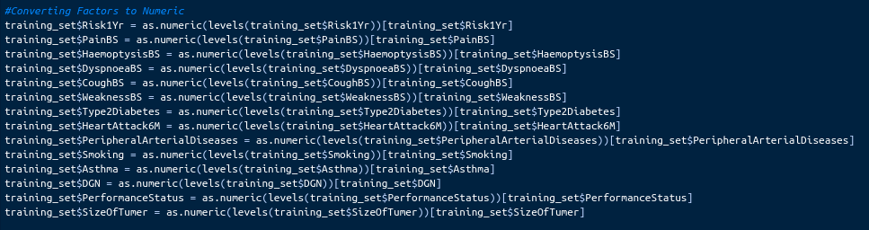
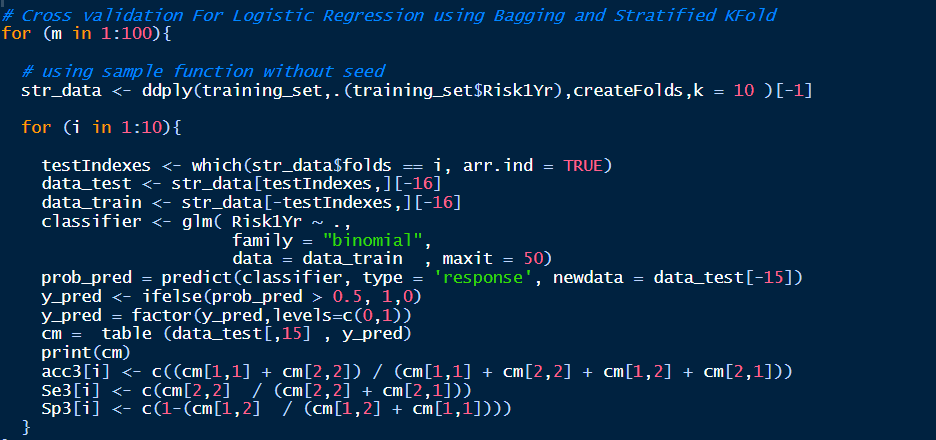

# Thoracic Surgery With Machine Learning.

## Introduction to Thoracic Surgery:
Thoracic surgery as its evolving and surgeons have major collaborative roles in management of lung cancer, respiratory infections, chest trauma, pediatric respiratory disorders and end-stage respiratory. Today, lung cancer is the most frequent indication for thoracic surgery. Thoracic Surgeries focuses on the chest organs, including the esophegus , trachea , pleura , chest wall, diaphragm, heart, and lungs. Technological advances have increased the safety and availability of these complex surgical procedures. Lung cancer surgeries and anti-reflex surgeries save and improve lives around the world. The most common diseases requiring thoracic surgery include lung cancer, chest trauma (require urgent thoracic surgery), esophageal cancer, emphysema and lung transplantation.

## Dataset Information:
The data was collected retrospectively at Wroclaw Thoracic Surgery Centre for patients who underwent major lung resections for primary lung cancer in the years 2007 & 2011. 

### Features: 
We have 17 Features in our dataset which are:
* Diagnosis. 
* Forced Vital Capacity.
* Forced Expiratory Volume.
* Performance Status.
* Pain Before Surgery. 
* Haemoptysis Before Surgery.
* Dyspnoea Before Surgery. 
* Cough Before Surgery. 
* Weakness Before Sugery. 
* Size Of Tumer.
* Type 2 Diabetes. 
* Heart Attack 6M. 
* Peripheral Arterial Diseases.
* Smoking (T,F).
* Asthma (T,F).
* Age.
* Risk 1 Year.

## R-Programming Language:
R is a clear and accessible programming tool. R includes machine learning algorithm, linear regression, time series, statistical inference to name a few.

## Methods Used in Machine Learning by R-Language:

### Naive Bayes:
Naive Bayes is a classification algorithm for binary (two-class) and multiclass classification problems. The technique is easiest to understand when described using binary or categorical input values.

#### Advantages of Naive Bayes:
* When assumption of independent predictors holds true, a Naive Bayes classifier performs better as compared to other models.
* Naive Bayes requires a small amount of training data to estimate the
test data. So, the training period is less.
* Naive Bayes is also easy to implement.

### K-nearest Neighbors (KNN) Mode:

KNN is an algorithm that is considered both non-parametric and an example of lazy learning.

#### Advantages of KNN:
* Very simple implementation.
* Classifier can be updated online at very little cost as new instances with known classes are presented.
* Few parameters to tune: distance metric and k.

### Logistic Regression:
Logistic regression is a technique borrowed by machine learning from the field of statistics.

#### Advantages of Logistic regression:
* Very efficient.
* Doesn’t require too many resources.
* Easy to regularize.
* Easy to implement.

## Thoracic Surgery by Machine Learning:

### Data Pre-proccessing: 
By applying the t-test which takes a sample from each of the two sets and establishes the problem statement by assuming a null hypothesis that the two means are equal. Based on the applicable formulas, certain values are calculated and compared against the standard values, and the assumed null hypothesis is accepted or rejected accordingly. 
We selected the most effective features on Risk 1 Year feature. We selected the the features that has p-value less than 0.05.
We won’t do any data imputation in our statistical model because our dataset is complete and doesn’t have any missing values in them.

### Importing Libraries in R :

### Importing Dataset and Encoding Features:

### Scaling and Splitting Dataset into Training and Test sets:

### Feature Selection:

### Cross Validation For Naive Bayes:

#### Results Obtained without Feature Selection:

| Accuracy | Sensitivity | Specifity |
|----------|-------------|-----------|
| 0.77166  |    0.15     |  0.8828   |
 
#### Results obtained by Feature selection:

| Accuracy | Sensitivity | Specifity |
|----------|-------------|-----------|
| 0.7717   |    0.1785   |   0.886   |

### Cross Validation For KNN:

#### Results obtained without Feature Selection:

| Accuracy | Sensitivity | Specifity |
|----------|-------------|-----------|
|  0.8343  |   0.05      |   0.9756  |

#### Results obtained by Feature selection:

| Accuracy | Sensitivity | Specifity |
|----------|-------------|-----------|
|  0.8038  |    0.06     |    0.94   |

### Converting Factors to Numeric:

### Cross Validation For Logistic Regression:
#### Bagging:
Bagging and bootstrap aggregation, is a relatively simple way to increase the power of a predictive statistical model by taking multiple random samples(with replacement) from your training data set, and using each of these samples to construct a separate model and separate predictions for your test set. These predictions are then averaged to create a, hopefully more accurate, final prediction value.
##### Stratified K-Folds:
Stratification is the process of rearranging the data as to ensure each fold is a good representative of the whole. For example in a binary classification problem where each class comprises 50% of the data, it is best to arrange the data such that in every fold, each class comprises around half the instances.

#### Results Obtained: 

| Accuracy | Sensitivity | Specifity |
|----------|-------------|-----------|
| 0.8339   |   0.0311    |   0.9787 |
 
#### By making Feature selection, we obtained that :

| Accuracy | Sensitivity | Specifity |
|----------|-------------|-----------|
| 0.8249   |    0.5   |   0.8828  |

### Visualization of Data:
 From Feature selection, we chose Age and Size Of Tumer because they have the least p-value and the largest t-score.
 * Plotting y-pred with Age.
 
 * Plotting y-pred with Size Of Tumer.
 
## Team Members:
* <a href="https://asmaamahmoud12.github.io/Asmaa-Mahmoud/" target="_blank">Asmaa Mahmoud </a>
* <a href="https://alaagamal98.github.io/AlaaGamal/ " target ="_blank"> Alaa Gamal </a> 
* <a href="https://salmazakariia.github.io/SalmaZakaria/" target="_blank">Salma Zakaria </a>
* <a href ="https://marwaayosiif.github.io/MarwaYoussef/" target = "_blank"> Marwa Youssef </a>
